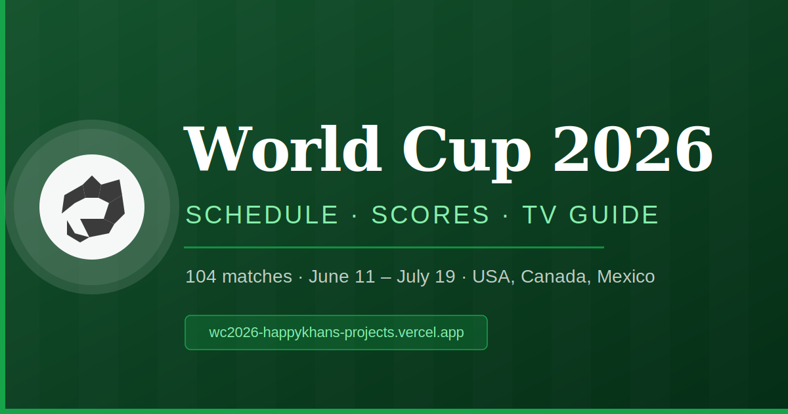

# World Cup 2026 ⚽️

A fast, ad-free **FIFA World Cup 2026** companion: the full schedule, live scores, lineups & stats, and the exact TV channel to tune into — all in your timezone and your language.

**▶ Live:** [worldcup.happykhan.com](https://worldcup.happykhan.com)

[](https://worldcup.happykhan.com)
[](#testing)
[](LICENSE)



---

## Features

- 📅 **All 104 matches** — group stage through the final, grouped by day, in **your** timezone (auto-detected) with a **12h/24h** toggle.
- 🔴 **Live scores** with a real **second-by-second match clock** that keeps ticking through stoppage and stops on the whistle.
- 📺 **Where to watch** — per-match UK channels (BBC One/Two, ITV1/ITV4 + iPlayer/ITVX/STV) shown above the fold, plus broadcaster data for ~130 territories.
- 📊 **Lineups, stats & a goal/card/sub timeline** per match (formations, possession, shots, xG…).
- 🎨 **Team themes** — pick any of the 48 nations and the whole app recolours in their kit; your starred teams float to the top.
- 🌐 **Four languages** (English, Français, Español, Deutsch) with **localised team & group names** (USA → Estados Unidos, Group A → Grupo A).
- ⭐ **Favourites & follow-a-team**, **share cards** with the live score baked into the preview, and **calendar (.ics) export**.
- 🏆 **Group tables** and a **knockout bracket**.
- 📱 Installable **PWA**, dark mode, no ads, no tracking.

## Why it's interesting

This project is a small case study in serving live sports data **without paying for an API or a metered cloud service**:

- **No paid APIs.** Live scores, lineups, stats and events all come from **ESPN's free public endpoints** — no key, no daily cap.
- **Burst-safe caching on a VM, not a metered service.** A 1-minute cron poller runs on a plain box, merges ESPN over the static schedule, and writes a small `scores.json`. It's served publicly through a **Cloudflare Tunnel** (zero egress) and the app's `/api/scores` just proxies it — edge-cached, so ESPN and the VM each see roughly **one request per minute regardless of traffic**.
- **The build is the safety net.** `npm run build` runs **Vitest + tsc + Vite** in series, so a failing test or type error blocks the deploy. The live-clock, status mapping, team-alias matching, and poller rules are all covered.

```
                 ESPN free API (scoreboard + summary)
                          │  (1 req/min, only during live windows)
            ┌─────────────▼──────────────┐
            │  VM cron poller             │   scripts/vm-poller.mjs
            │  fixtures.json + ESPN merge │   → /home/nabil/wc2026-data/scores.json
            └─────────────┬──────────────┘
                          │  Cloudflare Tunnel (no egress charge)
                 wc-scores.genomicx.org/scores.json
                          │
            ┌─────────────▼──────────────┐
            │  Vercel  /api/scores        │   thin proxy, edge-cached ~30–60s
            │  /api/matchdetail (ESPN)    │   /api/share + /api/og (preview cards)
            └─────────────┬──────────────┘
                          │
                 Vite + React SPA (worldcup.happykhan.com)
```

## Tech stack

- **React 19** + **TypeScript** + **Vite 8**, **Tailwind CSS v4**
- **Vitest** for unit tests, **ESLint** for linting
- **date-fns / date-fns-tz** (timezone-correct rendering), **lucide-react** (icons)
- **Vercel** serverless functions (`/api`), **@vercel/og** (dynamic preview images), **ical-generator** (calendar export)
- Live data: **ESPN public API**; cache hosting: a VM + **cloudflared** tunnel

## Getting started

```bash
git clone https://github.com/happykhan/wc2026.git
cd wc2026
npm install
npm run dev          # http://localhost:5173
```

Other scripts:

```bash
npm run build        # vitest run && tsc -b && vite build  (the gated build)
npm test             # run the test suite once (vitest run)
npx vitest            # tests in watch mode
npm run lint         # eslint
npm run fetch-fixtures   # regenerate src/data/fixtures.json
```

No environment variables are required for local development — the app reads the
public `scores.json` and ESPN's open endpoints.

## Project structure

```
src/
  components/   MatchRow, FilterBar, GroupTable, Header, …
  pages/        Schedule, Groups, Bracket, Settings
  hooks/        useLiveScores, usePreferences, useTheme
  data/         fixtures.json, teamMatch (alias map), teamColors (themes),
                teamFlags, tvChannels, ukTvSchedule, i18n/
  utils/        time, liveClock, labels
api/            scores (proxy), matchdetail, share, og, afl, …  (Vercel functions)
scripts/        vm-poller.mjs (+ pollerLib.mjs), vm-server.mjs, watchdog, fetchers
```

## How live data works

`scripts/vm-poller.mjs` runs on a VM via cron every minute. It builds a base list
from the static `fixtures.json`, overlays ESPN's live data for matches that are in
progress or just finished, carries scores forward so a blank fetch never erases a
result, and writes `scores.json` atomically. `scripts/vm-server.mjs` serves that
file, exposed publicly via a cloudflared tunnel. The pure rules (full-time
detection, ESPN's US-local date filing, minute parsing, team-name matching) live in
`scripts/pollerLib.mjs` and are unit-tested.

## Testing

The team-name alias map is mirrored across three runtimes that can't share a module
(the bundled frontend, the raw-node poller, and the isolated Vercel function); a
parity test fails the build if they ever drift. The live-clock and status logic are
pure functions with regression tests for the bugs they've actually had. Run them
with `npx vitest run`.

## Contributing

Contributions welcome — see [CONTRIBUTING.md](CONTRIBUTING.md).

## License

[MIT](LICENSE) © Nabil-Fareed Alikhan
