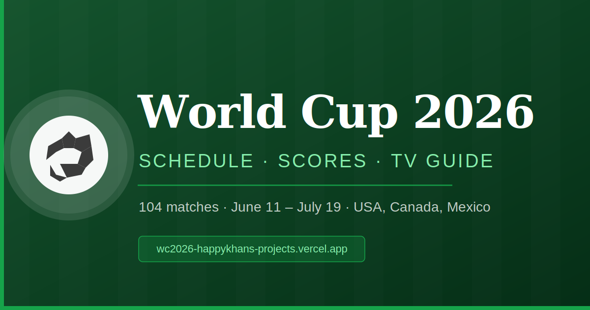

# World Cup 2026 ⚽️

A fast, ad-free **FIFA World Cup 2026** archive: the full schedule, final results, lineups & stats, and the exact TV channel used for each match — all in your timezone and your language.

**▶ Live:** [worldcup.happykhan.com](https://worldcup.happykhan.com)

[](https://worldcup.happykhan.com)
[](#testing)
[](LICENSE)



---

## Features

- 📅 **All 104 matches** — group stage through the final, grouped by day, in **your** timezone (auto-detected) with a **12h/24h** toggle.
- ⚽ **Final results** for all 104 matches, including extra-time and penalty-shootout outcomes.
- 📺 **Where to watch** — per-match UK channels (BBC One/Two, ITV1/ITV4 + iPlayer/ITVX/STV) shown above the fold, plus broadcaster data for ~130 territories.
- 📊 **Lineups, stats & a goal/card/sub timeline** per match (formations, possession, shots, xG…).
- 🎨 **Team themes** — pick any of the 48 nations and the whole app recolours in their kit; your starred teams float to the top.
- 🌐 **Nine languages** — English, Français, Español, Deutsch, Português, Italiano, 日本語, 한국어 and العربية (right-to-left) — with **localised team & group names** (USA → Estados Unidos, Group A → Grupo A) resolved automatically via `Intl.DisplayNames`.
- ⭐ **Favourites & follow-a-team**, **share cards** with the final score baked into the preview, and **calendar (.ics) export**.
- 🏆 **Final group tables** and a complete **knockout bracket**.
- 📱 Installable **PWA**, dark mode, no ads, no tracking.

## Why it's interesting

During the tournament, this project served live sports data **without a paid or metered API**:

- **Free primary path, free fallbacks.** Scores were built from ESPN's free public endpoints first, with football-data.org and API-Football as guarded fallbacks.
- **Burst-safe collection.** A VM poller merged the feeds into a small snapshot every ~15 seconds during live windows. The retained implementation is documented in [`docs/legacy-vm-live-scores.md`](docs/legacy-vm-live-scores.md).
- **Self-contained final deployment.** With the tournament complete, `/api/scores` serves the validated final snapshot bundled in this repository. Production no longer depends on the VM, its tunnel, or a live score provider.
- **The build is the safety net.** `npm run build` runs **gen-match-index + Vitest + tsc + Vite** in series, so a failing test or type error blocks the deploy. The live-clock, status mapping, team-alias matching, and poller rules are all covered.

```
api/data/final-scores.json (104 finished matches, bundled at deploy time)
                          │
            ┌─────────────▼──────────────┐
            │  Vercel /api/scores         │   no runtime network dependency
            │  /api/matchdetail           │   on-demand match detail
            │  /api/share + /api/og       │   preview cards
            └─────────────┬──────────────┘
                          │
                 Vite + React SPA
                 worldcup.happykhan.com
```

## Tech stack

- **React 19** + **TypeScript** + **Vite 8**, **Tailwind CSS v4**
- **Vitest** for unit tests, **ESLint** for linting
- **date-fns / date-fns-tz** (timezone-correct rendering), **lucide-react** (icons)
- **Vercel** serverless functions (`/api`), **@vercel/og** (dynamic preview images), **ical-generator** (calendar export)
- Final scores bundled in the Vercel deployment; legacy collection scripts retained under `scripts/`

## Getting started

```bash
git clone https://github.com/happykhan/wc2026.git
cd wc2026
npm install
npm run dev          # http://localhost:5173
```

Other scripts:

```bash
npm run build        # gen-match-index && vitest run && tsc -b && API tsc && vite build
npm test             # run the test suite once (vitest run)
npx vitest            # tests in watch mode
npm run lint         # eslint
npm run fetch-fixtures   # regenerate src/data/fixtures.json
```

No environment variables are required for local development or the final score
snapshot. Optional match-detail fallbacks still use their existing Vercel environment
configuration.

## Project structure

```
src/
  components/   MatchRow, FilterBar, GroupTable, Header, …
  pages/        Schedule, Groups, Bracket, Settings
  hooks/        useLiveScores, usePreferences, useTheme
  data/         fixtures.json, teamMatch (alias map), teamColors (themes),
                teamFlags, tvChannels, ukTvSchedule, i18n/
  utils/        time, liveClock, labels
api/            scores (bundled snapshot), matchdetail, share, og, afl, …
scripts/        vm-poller.mjs (+ pollerLib.mjs), vm-server.mjs, watchdog, fetchers
```

## Final score data

`api/data/final-scores.json` is the validated final tournament snapshot: 104 finished
matches with a full-time score for every match and recorded shootout results where
applicable. Vercel bundles it with `/api/scores`, so serving results requires no VM,
tunnel, poller, or upstream score request. The former live-score architecture and
retained scripts are described in [`docs/legacy-vm-live-scores.md`](docs/legacy-vm-live-scores.md).

## Knockout bracket resolution

The original static fixture list stores Round-of-32 teams as FIFA slot labels such as
`1E`, `2H`, and `3A/B/C/D/F`. The app resolves those labels at runtime from the
same live scores feed that powers the schedule and group tables:

- `1A` / `2B` slots come from the current group standings.
- Third-place slots use FIFA's third-place allocation table in
  `src/data/thirdPlaceAllocation.ts`.
- `src/data/knockoutSlots.ts` is the shared resolver used by the bracket and
  `/match/:id` share metadata.
- If the displayed matchup depends on an unfinished group or an allocation that
  can still change, the schedule and bracket show a small warning icon. The icon
  disappears automatically once the relevant groups are complete and the matchup
  is final.
- `/match/:id` share metadata resolves the same slots, so copied/shared knockout
  links show real teams where the feed makes them knowable.

## Testing

The team-name alias map is mirrored across the frontend and retained collection
implementations; a parity test fails the build if they ever drift. The live-clock
and status logic remain as tested historical code. Knockout
resolution has fast unit coverage for group-slot resolution, current third-place
allocation examples, the shared slot resolver, and projected-vs-final fixture
flags. Run them with `npx vitest run`.

## Contributing

Contributions welcome — see [CONTRIBUTING.md](CONTRIBUTING.md).

## License

[MIT](LICENSE) © Nabil-Fareed Alikhan
